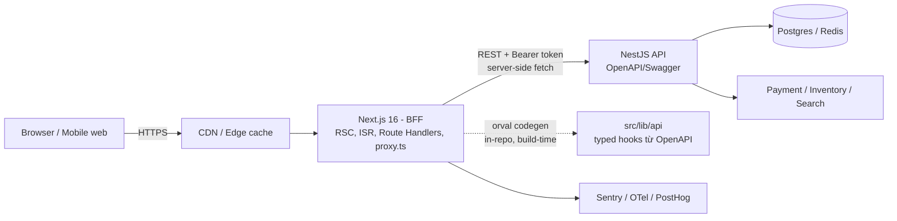
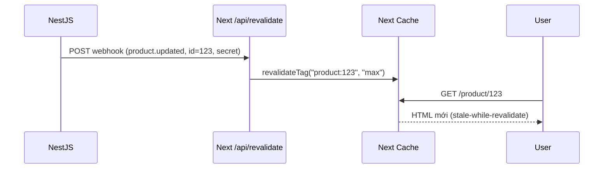

# Tech Stack & Kiến trúc — `comacpro-base-njs`

> **Bối cảnh**: Frontend E-commerce traffic cao, build trên **Next.js 16.2.7 (App Router) + React 19.2**. Backend tách riêng bằng **NestJS** (REST/OpenAPI). Auth phía FE dùng **Auth.js/NextAuth**. Tổ chức **polyrepo** (không monorepo) — có thêm app **admin/CMS** ở repo riêng.
> **Trạng thái**: **Phase 0 (nền tảng) đã implement & commit. Phase 1 (design system) đang chạy — shadcn đã init (Radix).** Đây là tài liệu sống, cập nhật theo tiến độ.
> _Cập nhật: 2026-06-03. Version đã verify trên npm registry tại thời điểm này._

---

## 0. TL;DR

**Stack chốt (1 dòng/layer):**

| Layer             | Chọn                                                                    | Version                            | Vì sao (ngắn)                                                  |
| ----------------- | ----------------------------------------------------------------------- | ---------------------------------- | -------------------------------------------------------------- |
| Repo strategy     | **Polyrepo** (mỗi app 1 repo) + **private registry** cho thư viện chung | —                                  | Phân quyền/độc lập/CI theo repo; chuẩn enterprise              |
| Language          | **TypeScript strict**                                                   | 5.x (≥5.1)                         | Bắt buộc cho scale; `strict` + `noUncheckedIndexedAccess`      |
| Schema/validation | **Zod 4**                                                               | 4.4.x                              | Nguồn sự thật cho type ở runtime (env, form, API boundary)     |
| UI                | **Tailwind 4 + shadcn/ui (Radix) + Tabler icons**                       | radix-ui 1.4.3, shadcn 4.10        | own-your-code, a11y (Radix), không lock-in                     |
| Server state      | **TanStack Query 5**                                                    | 5.100.x                            | Chuẩn de-facto cho data REST; cache/invalidation/retry         |
| Type-safe API     | **orval** (OpenAPI → TS + RQ hooks), generate **in-repo**               | 8.14.x                             | Sinh client + hook từ Swagger NestJS → type-safe đầu cuối      |
| Client state      | **Zustand 5 + nuqs**                                                    | zustand 5, nuqs 2                  | Zustand cho cart/UI; nuqs đưa filter/search lên URL            |
| Form              | **React Hook Form + Zod**                                               | rhf 7                              | Ít re-render, validate bằng chính Zod schema                   |
| Auth              | **Auth.js v5** _(hoặc Better Auth)_                                     | next-auth 5 beta / better-auth 1.6 | Honor lựa chọn; xem §7 trade-off                               |
| i18n              | **next-intl 4**                                                         | 4.13.x                             | Tích hợp App Router tốt nhất; routing + format                 |
| Env               | **@t3-oss/env-nextjs + Zod**                                            | 0.13.x                             | Fail-fast khi thiếu/sai env, tách server/client                |
| Lint/format       | **ESLint flat (next) + Prettier**                                       | eslint 9 + prettier 3              | Cần `@next/eslint-plugin-next` cho Core Web Vitals             |
| Git hygiene       | **Husky + lint-staged + commitlint + Changesets**                       | latest                             | Guardrail commit; Changesets versioning cho package dùng chung |
| Test              | **Vitest 4 + Testing Library + Playwright 1.60 + MSW**                  | —                                  | Unit/component + E2E + mock API                                |
| Observability     | **Sentry + OpenTelemetry + web-vitals**                                 | latest                             | Error + tracing (Next 16 có `instrumentation` sẵn)             |
| Product analytics | **PostHog**                                                             | latest                             | Funnel e-commerce, feature flag, A/B                           |
| CI/CD             | **GitHub Actions + Docker standalone**                                  | —                                  | Pipeline lint→typecheck→test→build mỗi repo; cache pnpm store  |

**Thứ tự build (5 phase):**
`P0 Nền tảng (TS, quality, CI)` ✅ → `P1 Design system + i18n` ⏳ → `P2 API contract + data layer` → `P3 Auth` → `P4 Tính năng e-commerce + caching/SEO` → `P5 Observability + hardening`. Chi tiết ở **§8**.

---

## 1. Nguyên tắc thiết kế (design principles)

Mọi lựa chọn bên dưới bám 6 nguyên tắc, xếp theo độ ưu tiên cho e-commerce traffic cao:

1. **Type-safety đầu cuối**: type chạy từ NestJS → OpenAPI → FE client → component. Không gõ tay type của API. Zod ở mọi "boundary" (env, form, dữ liệu ngoài).
2. **Server-first**: RSC làm mặc định; Client Component chỉ ở nơi cần tương tác. Giảm JS xuống client → LCP/TTI tốt cho mobile commerce.
3. **Cache-aware**: e-commerce sống nhờ caching. Thiết kế render mode + cache strategy **theo từng loại trang** ngay từ đầu (xem §6), không vá sau.
4. **Modular / feature-based**: tổ chức theo domain (catalog, cart, checkout, account…) thay vì theo loại file. Mỗi feature tự chứa, dễ tách team, dễ xoá.
5. **DX + guardrail tự động**: typecheck/lint/test/format chạy ở pre-commit và CI. Lỗi phải chặn ở máy dev.
6. **Tiến hoá dần (anti over-engineering)**: thêm độ phức tạp khi có nhu cầu thật. §9 liệt kê những thứ **chưa** nên thêm sớm.

---

## 2. Đánh giá base hiện tại

### 2.1. Đang có gì

- **Next.js 16.2.7** App Router, **React 19.2.4**, **TypeScript 5** (`strict`, path alias `@/*`).
- **Tailwind CSS 4** (qua `@tailwindcss/postcss`), **ESLint 9 flat config** (`eslint-config-next`).
- **pnpm** + có sẵn **`pnpm-workspace.yaml`**. **GIỮ file này** — nó **không có `packages:`** nên _không_ biến repo thành monorepo; nó chỉ chứa cấu hình pnpm cần thiết: `allowBuilds` (cho `sharp` của `next/image`) + `minimumReleaseAge` (supply-chain). Xoá đi sẽ mất các setting này.
- Sau Phase 0: đã có `src/config/env.ts`, quality tooling, CI, git hooks (xem §8).

### 2.2. Next.js 16 khác gì so với 14/15 (ảnh hưởng trực tiếp tới quyết định)

- **Turbopack mặc định** cho `next dev` và `next build`. Không cần `--turbopack`. Custom `webpack` → build fail (migrate sang `turbopack` config hoặc `--webpack`).
- **Async Request APIs (breaking)**: `cookies()`, `headers()`, `draftMode()`, `params`, `searchParams` **chỉ còn async** — phải `await`. Dùng `next typegen` để có `PageProps<'/route'>`.
- **Cache Components** (model caching mới): bật `cacheComponents: true` → directive **`use cache`** + **`cacheLife()`** + **`cacheTag()`** thay `export const revalidate`/`dynamic`. PPR cũ (`experimental_ppr`) đã gỡ, nay là một phần của Cache Components.
- **Revalidation API mới**: `revalidateTag(tag, profile)` (bắt buộc tham số 2), thêm **`updateTag()`** (read-your-writes, trong Server Action) và **`refresh()`**. `cacheLife`/`cacheTag` đã stable.
- **`middleware` → `proxy`**: đổi `middleware.ts` → `proxy.ts`, hàm `proxy()`. **Proxy chỉ chạy Node.js runtime, không edge** (cần edge → tạm giữ `middleware`).
- **`next/image` siết mặc định**: `minimumCacheTTL` 60s → **4h**; `qualities` mặc định `[75]`; `images.domains` deprecated → **`remotePatterns`**; chặn local IP.
- **Bỏ `next lint`**: `next build` không còn lint. Tự chạy ESLint trong script + CI.
- **React Compiler stable** (opt-in `reactCompiler: true`): tự memo hoá. Node tối thiểu **20.9+**, TS **5.1+**.

### 2.3. Đã lấp (Phase 0) & còn thiếu

Phase 0 đã thêm: quality tooling, env validation, git hooks, CI. **Còn lại theo §8**: design system (đang làm — P1), i18n, API contract + data layer, auth, tính năng e-commerce + caching/SEO, observability.

---

## 3. Kiến trúc tổng thể

### 3.1. Vai trò: Next.js là BFF đứng trước NestJS

Next.js **không thay** NestJS. Nó là **Backend-for-Frontend**: render (RSC/SSR/ISR), tổng hợp/định hình dữ liệu cho UI, giữ session, đặt secret gọi NestJS. NestJS vẫn là **system of record** (business logic, DB, payment, inventory…).



**Nguyên tắc gọi API:**

- Dữ liệu **public/cacheable** (catalog, PDP, PLP): fetch **server-side trong RSC**, bọc `use cache` + `cacheTag`.
- Dữ liệu **per-user/realtime** (cart, account, checkout): fetch client qua **TanStack Query**, hoặc RSC động bọc `<Suspense>`.
- **Không** gọi NestJS trực tiếp từ browser với secret. Token gắn server-side hoặc qua Route Handler/`proxy`.

### 3.2. Chiến lược repo: Polyrepo + private registry

Mỗi surface là một repo độc lập: **`storefront`** (repo này), **`admin/CMS`**, **NestJS** (đã riêng). Lý do hợp enterprise: phân quyền theo repo, deploy/release độc lập, team tự chủ, blast radius nhỏ, audit rõ ràng.

Không monorepo vẫn chia sẻ code tốt — đổi cơ chế từ "workspace linking" sang **"publish package có version"**:

- **API client — không share code.** Mỗi repo FE tự chạy `orval` (`pnpm gen:api`) sinh client **in-repo** từ cùng một **OpenAPI spec đã version** của NestJS. Single source of truth = spec.
- **Design system / config → private registry.** Publish scoped package: `@comacpro/ui` (gồm design tokens + tailwind preset), `@comacpro/config` (eslint + tsconfig + prettier), `@comacpro/utils`.
- **Mỗi package dùng chung = một repo** (thuần polyrepo). Gộp hợp lý: `ui`+tokens+preset chung 1 repo; `eslint`+`tsconfig`+`prettier` chung 1 repo `config`.

> Tùy chọn gọn hơn: gom thư viện vào **một repo `frontend-shared`** (workspace nhỏ chỉ cho lib + Changesets) — vẫn polyrepo cho các app.

**Đánh đổi:** mất sửa-xuyên-repo trong 1 PR (phải bump version → publish → cập nhật consumer) + link local tức thì (dùng **yalc**/`pnpm link`). Trị **version drift** bằng **Renovate/Dependabot**.

**Private registry** chọn theo git host: GitHub Packages / GitLab / Azure Artifacts / AWS CodeArtifact / JFrog, hoặc self-host Verdaccio. `.npmrc` mỗi repo:

```ini
@comacpro:registry=https://<your-registry>
//<your-registry>/:_authToken=${NPM_TOKEN}
```

### 3.3. Type-safe contract với NestJS

NestJS bật **Swagger/OpenAPI** (`@nestjs/swagger`) → xuất `openapi.json`. Mỗi repo FE chạy **orval** (in-repo) generate: TS types khớp 100% BE, **TanStack Query hooks** + Zod schema, một `mutator` (ky/axios) gắn token & base URL. BE đổi contract → gen lại → **TypeScript báo đỏ** ngay. Pin spec theo version API (`/openapi.json` của `v1`).

_Alternative_: **@hey-api/openapi-ts** nếu chỉ cần client + types; hoặc **openapi-fetch** + tự viết hook.

---

## 4. Tech stack theo từng layer

### 4.1. Nền tảng repo

- **pnpm**. **Polyrepo**: mỗi app một repo; thư viện chung qua private registry (§3.2). _Không Turborepo/Nx._
- **TypeScript** `strict` + `noUncheckedIndexedAccess` + `noImplicitOverride`. Config base chia sẻ qua **`@comacpro/config`** (mỗi repo `extends`).

### 4.2. UI & Styling

- **Tailwind CSS 4** + **shadcn/ui** (own code) trên **Radix UI** (gói hợp nhất **`radix-ui`**, không cài lẻ `@radix-ui/react-*`) + **class-variance-authority** + **tailwind-merge** + **clsx** + **@tabler/icons-react** (icon). Style shadcn: `radix-nova`. Stylesheet: **`src/styles/globals.css`**.
- **Radix vs Base UI** (verify 2026-06-03): chọn **Radix** — `radix-ui` 1.4.3 stable, release đều (bản mới ra 06/2026). **Base UI** (`@base-ui-components/react`) vẫn `1.0.0-rc.0` và **đứng im ~6 tháng** → chưa nên cược cho production; theo dõi tới 1.0 stable.
- **Base color**: khuyến nghị **Stone** (neutral ấm, hợp tông Claude). _Hiện `components.json` đang để **`zinc`** (lạnh)_ — nếu muốn tông ấm, đổi `baseColor` sang `stone` rồi áp lại token.
- **Palette (Claude-inspired, warm)**: primary coral `#D97757`, nền ivory `#FAF9F5`/dark `#262624`, neutral ấm (stone). Ghi token dạng **oklch** vào `globals.css` (light + dark).
- **pointer-on-buttons: ON** (commerce cần affordance click). **RTL: OFF** (bật lại rẻ nếu sau này có thị trường RTL).
- _Vì sao shadcn_: không phải dependency runtime → không lock-in, customize tự do, a11y sẵn (Radix). _Alt_: MUI/Mantine (nặng, khó theo brand).
- _E-commerce_: component brand (ProductCard, PriceTag, RatingStars, QuantityStepper…) tự compose trong **`@comacpro/ui`**; primitive a11y khó (Dialog, Combobox, Select, Menu…) lấy từ Radix. Dùng **next/font** tránh CLS.

### 4.3. Server state & data fetching

- **TanStack Query 5** cho client-side (cart, wishlist, account, infinite scroll PLP) + **RSC `fetch` + `use cache`** cho server-side cacheable. Dùng **HydrationBoundary** prefetch ở server rồi hydrate xuống RQ (PLP/PDP).

### 4.4. HTTP client & codegen

- **ky** (nhẹ, interceptor) hoặc **axios** làm `mutator`; **orval** generate hook + types từ OpenAPI **in-repo** (§3.3). Interceptor lo refresh token, retry idempotent (GET), gắn `Accept-Language`/currency.

### 4.5. Client state & URL state

- **Zustand 5**: cart (persist), UI state. **nuqs 2**: filter/sort/search/pagination ↔ URL query (shareable + SEO category). _Alt_: Jotai/Redux Toolkit (tránh Redux trừ khi state rất phức tạp).

### 4.6. Form & validation

- **React Hook Form 7** + **Zod 4** + **@hookform/resolvers**. Checkout/address nhiều bước → RHF + `zodResolver`. Mutation đơn giản (newsletter, review) có thể dùng Server Action + `useActionState` (React 19).

### 4.7. Auth — xem §7

- **Auth.js v5** (honor lựa chọn) quản session ở Next, propagate token sang NestJS. ⚠️ v5 vẫn beta (`5.0.0-beta.31`); **Better Auth 1.6** là alternative chín hơn cho kiến trúc tách BE.

### 4.8. i18n

- **next-intl 4**: routing theo locale (qua `proxy.ts`), format số/tiền/ngày, tích hợp App Router & RSC tốt nhất. _Alt_: Paraglide (build-time, nhẹ).

### 4.9. Env & config

- **@t3-oss/env-nextjs + Zod** (`src/config/env.ts`): validate lúc build/boot, tách `server`/`client` (`NEXT_PUBLIC_*`), `SKIP_ENV_VALIDATION` cho CI. Đã làm ở Phase 0.

### 4.10. Code quality

- **ESLint 9 flat** (giữ `eslint-config-next` cho rule Core Web Vitals) + **Prettier 3** (format). `eslint-config-prettier` tắt rule trùng; **`prettier-plugin-tailwindcss`** sort class — ⚠️ **`tailwindStylesheet` phải trỏ `./src/styles/globals.css`** (sau khi shadcn dời file). Config gói trong `@comacpro/config` để các repo dùng chung. Đã làm ở Phase 0.

### 4.11. Git hygiene & versioning

- **Husky + lint-staged + commitlint** (Conventional Commits; chỉ override `scope-case: kebab`, scope tự do) ở mọi repo + **Changesets** cho repo thư viện chung. Đã làm ở Phase 0.

### 4.12. Testing

- **Vitest 4** + **@testing-library/react**, **Playwright 1.60** (E2E), **MSW** (mock NestJS), **Storybook** (phát triển component trong `@comacpro/ui`). E2E critical: search → PLP filter → PDP → add cart → checkout → payment callback.

### 4.13. Observability & monitoring

- **Sentry** (error + performance/replay), **OpenTelemetry** qua `instrumentation.ts`, **web-vitals**. Trace request xuyên FE→NestJS.

### 4.14. Product analytics & feature flags

- **PostHog**: funnel (view → add cart → checkout → purchase), session replay, feature flag + A/B. _Alt flags_: OpenFeature/Flagsmith/GrowthBook.

### 4.15. Performance & SEO (đặc thù e-commerce)

- **next/image** + `remotePatterns` CDN. **JSON-LD** (`Product`, `Offer`, `BreadcrumbList`). **Metadata API** + `generateMetadata` cho PDP/PLP; `sitemap.ts` (+`generateSitemaps`) + `robots.ts`. **@next/third-parties**/Partytown offload script bên thứ 3. **React Compiler** giảm re-render list.

### 4.16. CI/CD & deploy

- **GitHub Actions** (pipeline mỗi repo): `typecheck → lint → format:check → build`, cache pnpm store, auth registry bằng `NPM_TOKEN`. Đã làm ở Phase 0. **Deploy**: Vercel (tối ưu Next) hoặc self-host **Docker** (`output: 'standalone'`).

---

## 5. Cấu trúc thư mục (repo `storefront`)

Polyrepo. Single Next.js app, tổ chức **feature-based** theo domain.

```text
storefront/                          # = comacpro-base-njs
├─ src/
│  ├─ app/                           # App Router (route = URL, mỏng)
│  │  ├─ [locale]/                   # i18n routing (next-intl)
│  │  │  ├─ (shop)/                  # catalog, pdp, plp, search
│  │  │  ├─ (checkout)/              # cart, checkout (dynamic, no-cache)
│  │  │  ├─ (account)/               # account (auth-gated)
│  │  │  └─ layout.tsx
│  │  ├─ api/                        # Route Handlers (BFF, webhooks)
│  │  ├─ sitemap.ts | robots.ts | manifest.ts
│  ├─ features/                      # ★ business logic theo domain
│  │  ├─ catalog/  cart/  checkout/  search/  account/
│  ├─ components/                    # dùng chung trong app
│  │  └─ ui/                         # shadcn (button.tsx, dropdown-menu.tsx…)
│  ├─ lib/
│  │  ├─ api/                        # ★ orval generate in-repo từ OpenAPI
│  │  ├─ utils.ts                    # cn() (shadcn)
│  │  └─ auth/  query-client/  fetcher/  seo/  analytics/
│  ├─ config/                        # env.ts (t3-env), site config, nav
│  ├─ i18n/                          # next-intl config, messages/
│  ├─ styles/
│  │  └─ globals.css                 # Tailwind 4 + design tokens (shadcn)
│  └─ proxy.ts                       # (thay middleware) auth/locale/redirect
├─ tests/                            # e2e (Playwright), test-utils
├─ orval.config.ts                   # codegen từ openapi.json
├─ components.json                   # shadcn config (Radix, tabler, baseColor)
├─ .husky/  .github/workflows/  .npmrc
├─ next.config.ts  package.json  pnpm-workspace.yaml   # GIỮ pnpm-workspace.yaml
└─ docs/tech-stack.md                # tài liệu này
```

**Thư viện dùng chung** (repo riêng, publish registry): `@comacpro/ui`, `@comacpro/config`, `@comacpro/utils`. **Repo `admin`**: Next.js app riêng, cùng tiêu thụ `@comacpro/*` + tự gen API client.

**Quy ước feature module:**

```text
features/catalog/
├─ components/   # ProductCard, ProductGallery, FilterSidebar…
├─ hooks/        # useProductFilters (nuqs), useAddToCart…
├─ api/          # re-export hook orval + query options/keys
├─ schema/       # zod schema riêng của feature
└─ index.ts      # public API của module
```

---

## 6. Chiến lược caching & rendering cho e-commerce

| Trang            | Render                  | Cache (Next 16)                                                       | Revalidate khi                                                          |
| ---------------- | ----------------------- | --------------------------------------------------------------------- | ----------------------------------------------------------------------- |
| Home / Landing   | RSC tĩnh phần lớn       | `use cache` + `cacheLife('hours')`                                    | CMS đổi → `revalidateTag('home')`                                       |
| Category / PLP   | RSC shell + filter động | shell `use cache` + `cacheTag('plp:{cat}')`; list stream `<Suspense>` | đổi giá/tồn → tag theo category                                         |
| Product / PDP    | RSC + ISR theo tag      | `use cache` + `cacheTag('product:{id}')`                              | giá/tồn/nội dung đổi → `revalidateTag('product:{id}')` (webhook NestJS) |
| Search           | Client (TanStack Query) | cache kết quả ở RQ                                                    | —                                                                       |
| Cart / Mini-cart | Client + per-user       | **không cache**                                                       | optimistic update (RQ)                                                  |
| Checkout         | Dynamic, per-request    | **no-store**, `cookies()`                                             | —                                                                       |
| Account          | Dynamic, auth-gated     | **no-store**                                                          | `updateTag('user:{id}')` sau khi user sửa                               |

**Quy tắc:** bật `cacheComponents: true`; public bọc `use cache` + `cacheTag`, per-user bọc `<Suspense>`/client. **Tag-based revalidation là xương sống**: NestJS đổi giá/tồn → webhook → Route Handler `/api/revalidate` → `revalidateTag('product:{id}', 'max')`. **read-your-writes**: dùng `updateTag()` trong Server Action. Đặt CDN trước Next; ảnh qua `next/image` + `remotePatterns`. Đo bằng Lighthouse/Vercel Analytics.



---

## 7. Auth deep-dive (Auth.js + NestJS) — ⚠️ đọc kỹ

### 7.1. Vấn đề kiến trúc

NestJS là **authority** (cấp JWT/refresh, lưu user). Next cần: đăng nhập, giữ session, **gắn token hợp lệ vào mỗi request sang NestJS**, refresh khi hết hạn. Khó nhất là **đồng bộ token Next ↔ NestJS**.

### 7.2. Pattern với Auth.js v5

1. **Credentials provider** (gọi `POST /auth/login` NestJS) và/hoặc OAuth (với OAuth, exchange lấy token nội bộ NestJS).
2. **`jwt` callback**: lưu `accessToken`+`refreshToken`+`expiresAt`; sắp hết hạn → gọi `POST /auth/refresh`.
3. **`session` callback**: chỉ lộ thông tin cần; giữ accessToken server-side (httpOnly cookie Auth.js mã hoá).
4. `mutator` orval đọc accessToken → `Authorization: Bearer`.
5. **`proxy.ts`** chặn `(account)`/`(checkout)`, xử lý locale.

> ⚠️ Auth.js v5 (`next-auth@5`) **vẫn beta** (`5.0.0-beta.31`, ~2.5 năm). `next-auth@4` (4.24.14) stable, hỗ trợ `next ^16` nhưng pattern cũ.

### 7.3. Alternative: **Better Auth 1.6** (stable)

BE tách riêng → Better Auth hợp gu: TypeScript-native, **plugin Bearer/JWT/JWKS** để NestJS tự verify token, **organization/multi-tenant, 2FA** sẵn, đã stable v1.6. Cân nhắc nếu muốn NestJS verify JWT độc lập qua JWKS / cần multi-tenant.

### 7.4. Authorization

RBAC theo role/scope **đặt tại NestJS** (nguồn sự thật). FE chỉ ẩn/hiện UI theo role — **không** tin client-side check cho bảo mật.

---

## 8. Thứ tự build (roadmap)

Nguyên tắc: dựng nền & guardrail trước, tính năng sau. Mỗi phase có Definition of Done (DoD).

### Phase 0 — Nền tảng & guardrail ✅ ĐÃ XONG

1. **Quality**: `@comacpro/config` (tách sau khi có registry) — hiện inline trong repo: tsconfig strict+, ESLint flat (giữ `eslint-config-next`), Prettier + `prettier-plugin-tailwindcss`.
2. **Env validation** (`@t3-oss/env-nextjs` + Zod), import trong `next.config.ts`. `next.config.ts`: `images.remotePatterns` (+ cân nhắc `reactCompiler`, `cacheComponents` sau).
3. **Git hooks**: Husky + lint-staged + commitlint.
4. **CI** (GitHub Actions): typecheck + lint + format:check + build, cache pnpm store.
5. **GIỮ `pnpm-workspace.yaml`** (chứa pnpm config, không phải monorepo marker).

**DoD ✅**: `pnpm lint && typecheck && build` xanh; commit sai convention bị chặn; CI chạy trên PR.

### Phase 1 — Design system + i18n ⏳ ĐANG LÀM

1. **shadcn/ui init** ✅ (Radix, tabler icon, pointer ON, RTL OFF). Đã có `button`, `dropdown-menu`, `lib/utils.ts`. _Còn lại_: chốt base color (stone cho tông ấm) + áp **token màu Claude-style (oklch)** vào `src/styles/globals.css` (light + dark).
2. **`@comacpro/ui`** (repo riêng): chuyển/đóng gói primitives + design tokens; Storybook; publish registry. _Hiện tạm để trong storefront, tách khi dựng registry._
3. **next-intl**: `[locale]` routing, messages, format tiền/ngày; `proxy.ts` xử lý locale.
4. App shell: `layout.tsx`, header/footer, theme, font (`next/font`).

**DoD**: Storybook chạy; trang demo đổi locale + format tiền đúng; component brand cơ bản dùng được.

### Phase 2 — API contract + data layer

1. Lấy `openapi.json` từ NestJS Swagger (pin version API).
2. **orval in-repo** (`orval.config.ts` → `src/lib/api`): types + RQ hooks + zod; `mutator` (ky/axios). Script `pnpm gen:api`.
3. **TanStack Query** (QueryClient, HydrationBoundary, devtools). **MSW** mock API.

**DoD**: gọi 1 endpoint thật qua hook gen sẵn, type chạy đầu cuối; đổi spec → gen lại → TS báo đỏ.

### Phase 3 — Auth

1. Chốt **Auth.js v5** vs **Better Auth** (§7.3).
2. Provider (Credentials + OAuth), jwt/session callback, **refresh token**.
3. Gắn token vào `mutator`; `proxy.ts` chặn `(account)`/`(checkout)`.

**DoD**: login/logout/refresh chạy; gọi endpoint cần auth OK; route bảo vệ redirect đúng.

### Phase 4 — Tính năng e-commerce + caching/SEO _(khối lớn nhất)_

1. **Catalog/PLP** + filter/sort/pagination (nuqs) + `use cache`/`cacheTag`.
2. **PDP**: `generateMetadata`, JSON-LD, ISR theo tag, webhook `/api/revalidate`.
3. **Search** (TanStack Query; Algolia/Typesense/Meilisearch nếu có).
4. **Cart** (Zustand persist + optimistic) → **Checkout** (RHF + Zod, no-store) → **payment callback**.
5. **Account** (đơn hàng, địa chỉ; `updateTag`).
6. **SEO**: `sitemap.ts` (+`generateSitemaps`), `robots.ts`, breadcrumb JSON-LD, OG image.
7. **PostHog** funnel + feature flag; offload script bên thứ 3.

**DoD**: E2E (Playwright) đi hết search→PLP→PDP→cart→checkout xanh; Lighthouse PDP/PLP đạt ngưỡng; tag revalidation chạy.

### Phase 5 — Observability & hardening _(trước launch)_

1. **Sentry** + **OpenTelemetry** (`instrumentation.ts`) + **web-vitals**.
2. **Security headers/CSP**, rate-limit Route Handler nhạy cảm, kiểm secret không lộ client.
3. **Perf pass**: bundle analyze, dynamic import, kiểm ảnh, bật **React Compiler**.
4. **Docker `output: 'standalone'`** (self-host) hoặc Vercel.

**DoD**: lỗi/trace hiện dashboard; CSP/headers pass; build production + smoke test pass.

> **Phụ thuộc**: P0 ✅ → P1 & P2 song song được → P3 cần P2 → P4 cần P1+P2+P3 → P5 cuối.

---

## 9. Bảng quyết định & ranh giới (anti over-engineering)

### 9.1. Chọn vs Alternative

| Hạng mục      | Chọn                        | Alternative                 | Vì sao không chọn alt                                |
| ------------- | --------------------------- | --------------------------- | ---------------------------------------------------- |
| Repo strategy | Polyrepo + private registry | Monorepo (Turborepo/Nx)     | Enterprise: phân quyền/độc lập/CI theo repo          |
| UI primitive  | Radix (`radix-ui`)          | Base UI / styled lib (MUI…) | Base UI còn RC + đứng im; styled lib đè brand + nặng |
| Data          | TanStack Query + RSC        | SWR / chỉ RSC               | RQ giàu tính năng hơn cho commerce                   |
| API type-safe | orval (OpenAPI), in-repo    | tRPC / GraphQL              | BE là NestJS REST độc lập → codegen hợp hơn          |
| Client state  | Zustand + nuqs              | Redux Toolkit / Jotai       | Cart/UI đơn giản; Redux thừa                         |
| Auth          | Auth.js v5                  | Better Auth / NextAuth 4    | Theo lựa chọn; §7 trade-off                          |
| Lint          | ESLint(next)+Prettier       | Biome-only                  | Cần rule Core Web Vitals của plugin Next             |

### 9.2. CHƯA nên thêm sớm

- **tRPC/GraphQL layer** chồng lên NestJS REST — thừa, đã có OpenAPI codegen.
- **Redux** — Zustand + RQ đủ.
- **Micro-frontends / Module Federation** — chỉ khi nhiều team lớn tách rời thật.
- **Tách quá nhiều package/repo chung** — gộp `ui`+tokens, `config` để giảm overhead version.
- **Custom design system from scratch** — bắt đầu từ shadcn, tuỳ biến dần.
- **Tự build primitive a11y khó** (Dialog, Combobox, Select…) — lấy từ Radix.
- **Đa cloud / k8s phức tạp** — Vercel/Docker đơn giản trước.

---

## 10. Phụ lục

### 10.1. Bảng version pin (verify 2026-06-03, npm)

| Package                             | Version                    |     | Package               | Version |
| ----------------------------------- | -------------------------- | --- | --------------------- | ------- |
| next                                | 16.2.7                     |     | @tanstack/react-query | 5.100.x |
| react / react-dom                   | 19.2.x                     |     | zustand               | 5.0.x   |
| typescript                          | 5.x (≥5.1)                 |     | nuqs                  | 2.x     |
| tailwindcss                         | 4.x                        |     | react-hook-form       | 7.x     |
| zod                                 | 4.4.x                      |     | next-intl             | 4.13.x  |
| shadcn (CLI)                        | 4.10.x                     |     | @t3-oss/env-nextjs    | 0.13.x  |
| radix-ui                            | 1.4.3                      |     | eslint                | 9.x     |
| @tabler/icons-react                 | 3.44.x                     |     | prettier              | 3.x     |
| class-variance-authority            | 0.7.x                      |     | tailwind-merge        | 3.6.x   |
| orval                               | 8.14.x                     |     | vitest                | 4.1.x   |
| next-auth (Auth.js)                 | 5.0.0-beta.31 ⚠️ / 4.24.14 |     | @playwright/test      | 1.60.x  |
| better-auth (alt)                   | 1.6.13                     |     | @sentry/nextjs        | latest  |
| @base-ui-components/react (đã loại) | 1.0.0-rc.0                 |     |                       |         |

### 10.2. Lệnh tham khảo theo phase

```bash
# P0 (đã xong) — quality & nền tảng
pnpm add -D prettier prettier-plugin-tailwindcss @commitlint/cli @commitlint/config-conventional husky lint-staged
pnpm add @t3-oss/env-nextjs zod

# P1 — UI (shadcn đã init: Radix, tabler) & i18n
pnpm dlx shadcn@latest add button dropdown-menu ...   # thêm component khi cần
pnpm add next-intl
pnpm add -D storybook

# P2 — data & codegen
pnpm add @tanstack/react-query ky
pnpm add -D orval @tanstack/react-query-devtools msw

# P3 — auth (chọn 1)
pnpm add next-auth@beta            # Auth.js v5
# hoặc: pnpm add better-auth

# P4 — state/form/seo/analytics
pnpm add zustand nuqs react-hook-form @hookform/resolvers posthog-js @next/third-parties

# P5 — observability & test
pnpm add @sentry/nextjs
pnpm add -D vitest @testing-library/react @testing-library/jest-dom @playwright/test
```

### 10.3. Nguồn

- Next.js 16.2.7 docs (`llms-full.txt`): caching/`use cache`, async APIs, `proxy`, `next/image`, version-16, backend-for-frontend.
- npm registry (verify version).
